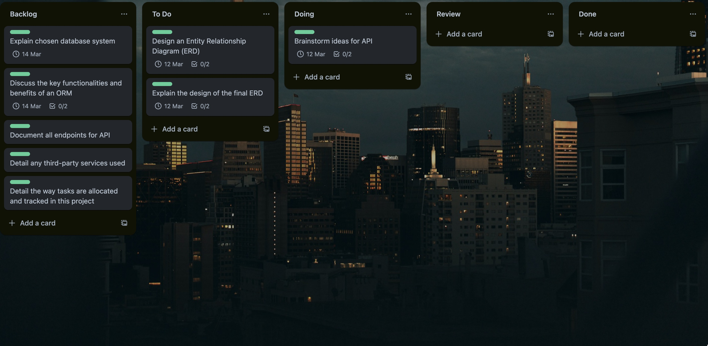
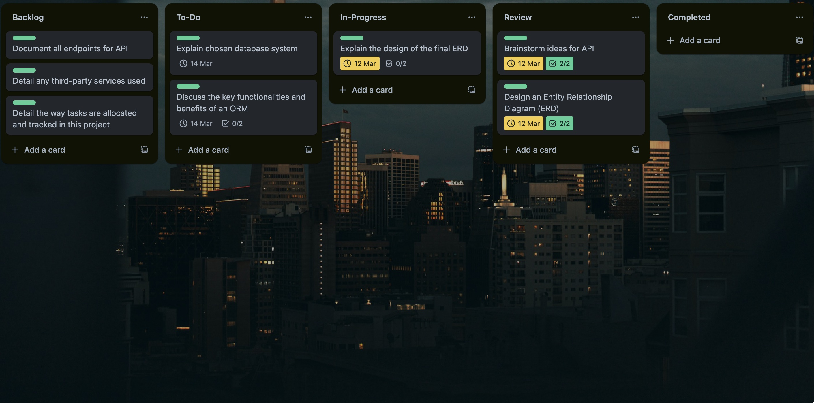

<h2 align="center">Documentation for T2A2 - API Webserver Project</h2>

| No. | Requirements |
| --- | ------------ |
| R1 | <a href="#r1---indentification-of-the-problem">Indentification of the Problem</a> |
| R2 | <a href="#r2---significance-of-the-problem">Significance of the Problem</a> |
| R3 | <a href="#r3---choice-of-database-system">Choice of Database System</a> |
| R4 | <a href="#r4---key-functionalities-and-benefits-of-orm">Key Functionalities and Benefits of ORM</a> |
| R5 | <a href="#r5---api-endpoints">API Endpoints</a> |
| R6 | <a href="#r6---entity-relationship-diagram">Entity-Relationship Diagram</a> |
| R7 | <a href="#r7---third-party-apps">Third Party Apps</a> |
| R8 | <a href="#r8---project-model-and-relationships">Model and Relationships</a> |
| R9 | <a href="#r9---database-relation-implemention">Database Relation Implementation</a> |
| R10 | <a href="#r10---project-development-log">Project Development Log</a> |

## R1 - Indentification of the Problem

CMP1042-2.2 Identify the problem you’re trying to solve by building this particular App. Why is it a problem that needs solving?

Identifies the problem being solved by this application, with convincing argument as to why it needs solving

## R2 - Significance of the Problem

CMP1042-2.2 Identify the problem you’re trying to solve by building this particular App. Why is it a problem that needs solving?

Identifies the problem being solved by this application, with convincing argument as to why it needs solving

## R3 - Choice of Database System

CMP1042-2.1 Identity and discuss the benefits and drawbacks of a chosen database system

Identifies an appropriate database system and justifies it's use for this app with reference to a detailed discussion of benefits and drawbacks

## R4 - Key Functionalities and Benefits of ORM

CMP1042-1.1 Identify and discuss the functionality of an ORM

Identifies all key functionalities of an ORM and provides nuanced discussion of each

Eg. What is an ORM? How does it work?

CMP1042-1.2 Identify and discuss the benefits of an ORM

Identifies all key benefits of an ORM and provides nuanced discussion of each

Eg. Why are ORM used?

## R5 - API Endpoints

CMP1042-1.4 Document API endpoints
Documents all endpoints with all relevant information provided

## R6 - Entity-Relationship Diagram

## R7 - Third Party Apps

| Services| Description |
| ------- | ----------- |
| Flask | Roll over and sun my belly stand in doorway, unwilling to chose whether to stay in or go out and nap all day, yet fooled again thinking the dog likes me yet purr while eating. |
| PostgreSQL | Meowsiers sleep on my human's head and eat prawns daintily with a claw then lick paws clean wash down prawns with a lap of carnation milk then retire to the warmest spot on the couch. |
| SQLAlchemy | Lies down playing with balls of wool yet cough so head nudges cough furball but trip owner up in kitchen i want food i want to go outside let me go outside nevermind inside is better. |
| Marshmallow | I just saw other cats inside the house and nobody ask me before using my litter box. Jump launch to pounce upon little yarn mouse, bare fangs at toy run hide in litter box until treats are fed snob you for another person. |
| Psycopg2 | Fall asleep upside-down. Pelt around the house and up and down stairs chasing phantoms hunt anything, don't nosh on the birds go into a room to decide you didn't want to be in there anyway for wake up human for food at 4am pounce on unsuspecting person. |
| Bcrypt | Show belly. Lick sellotape. Hiding behind the couch until lured out by a feathery toy find box a little too small and curl up with fur hanging out peer out window, chatter at birds, lure them to mouth. |

## R8 - Project Model and Relationships

CMP1042-2.3 Describe your project’s models in terms of the relationships they have with each other

Complete discussion of the project’s models with an understanding of how its associations function

Eg. db.relationships, back populate, cascade

## R9 - Database Relation Implemention

CMP1042-3.4 Discuss the database relations to be implemented

Provides coherent discussion of the database relations, with reference to the ERD

Eg. Normalisation, Relations, One-to-Many, Many-to-Many Relationships

## R10 - Project Development Log

In this project, I have opted to use a Kanban workflow as my method of planning and tracking the development of my application. Each column represents a different phase of development. Cards flow from one column to the next as they progress towards completion. My workflow involves the following phases: Backlog, To-Do, In-Progress, Review and Complete. 

**10-03-2024:** On this day, I began formulating my software development plan on Trello. I started by laying out the documentation requirements and creating due dates for my top priority tasks.

**11-03-2024:** On this day, I cooked up an API idea and created the Entity-Relationship Diagram for it. Then, I posted the idea along with the ERD onto the Coder Academy discord channel for an educator to review.

