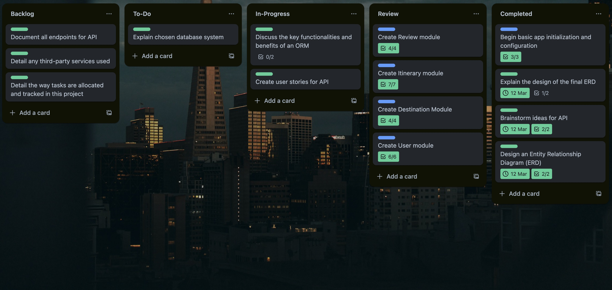

</img>

<h1 align="center">Documentation for  API Webserver Project</h1>

 <h3 align="center">


| No. | Section |
| --- | ------------ |
| R1 | <a href="#r1---identification-of-the-problem">Identification of the Problem</a> |
| R2 | <a href="#r2---significance-of-the-problem">Significance of the Problem</a> |
| R3 | <a href="#r3---choice-of-database-system">Choice of Database System</a> |
| R4 | <a href="#r4---key-functionalities-and-benefits-of-orm">Key Functionalities and Benefits of ORM</a> |
| R5 | <a href="#r5---api-endpoints">API Endpoints</a> |
| R6 | <a href="#r6---entity-relationship-diagram">Entity-Relationship Diagram</a> |
| R7 | <a href="#r7---third-party-apps">Third Party Apps</a> |
| R8 | <a href="#r8---model-and-relationships">Model and Relationships</a> |
| R9 | <a href="#r9---database-relation-implementation">Database Relation Implementation</a> |
| R10 | <a href="#r10---project-development-log">Project Development Log</a> |


## R1 - Identification of the Problem

Traveling is a deeply personal and enriching experience, however planning a trip can be complex and time-consuming, and often involves uncertainties and overwhelming amounts of information.

This API seeks to simplify the way people plan trips by offering a solution where users can easily share their travel itineraries and seek feedback from a community of fellow travelers. These travel itineraries serve as a starting point for travelers who want to explore new places without spending countless hours searching online. It aims to provide a centralised hub for comprehensive, personalised, and authentic travel information.

## R2 - Significance of the Problem

Planning a trip is not just about choosing a destination but also involves extensive research, creating an itinerary, and making numerous decisions. This process can take a significant amount of time and effort, which can leave many new travelers overwhelmed and exhausted. 

Unfortunately, this exhausting process is exacerbated by the amount of travel information available online today. Some websites provide good information, while some provide paid advertisements disguised as articles. For instance, some tour operators pay bloggers large amounts of money to write positive reviews of their tours. As a result, travelers may end up booking tours that fail to meet their expectations. 

To counteract these sort of biased and misleading reviews, it is important that the travel community play a role in maintaining the integrity of travel information. Hence, this API seeks to enable it by allowing real travelers to share their past itineraries and provide honest and authentic reviews and ratings. New travelers can benefit greatly from this shared knowledge, as this allows them to fact-check and not just rely only on travel guides written by professional writers whose opinions may or may not be influenced by advertising dollars.

Another common problem travelers face when planning for trips to unfamiliar destinations is dealing with anxiety and uncertainty. Getting confirmation from experienced travelers, or perhaps even locals, can significantly ease their worries and make the journey less stressful. That is why this API enables users to share their itineraries and receive feedback from other travelers. This sort of interaction can help build confidence and reduce anxiety.

## R3 - Choice of Database System

For this application, I chose PostgreSQL as my database system because it is open-source, free, and highly capable as a relational database management system (RDBMS). While other well-regarded RDBMS exist, such as Oracle and SQL Server, I selected PostgreSQL because it meets the scope of this application and aligns well with my current skill set as a developer.

PostgreSQL is a great database system for managing relational databases. Below I have listed the many benefits but also drawbacks of using PostgreSQL.

### Benefits:

- ***Open-source:*** 

    PostgreSQL is an open-source software, which means it's free to use, modify, distribute, and share. This makes it cost-effective as there are no licensing fees involved. 

- ***Extensive Features***:  

    PostgreSQL is well-known for offering an extensive range of advanced features that go beyond what is commonly found in other popular relational database management systems.

- ***Secure:*** 

    PostgreSQL has robust security features such as role-based access control, encryption support, and audit trails that help prevent unauthorised access, data theft, and other types of cyber threats.

- ***Scalability:*** 

    PostgreSQL allows database expansion via both horizontal scaling, where additional servers are added to share the workload, and vertical scaling, where existing hardware components are upgraded to manage increased processing demands.
 

- ***Flexibility:*** 

    PostgreSQL supports many different data types, including text, numeric, date/time, binary, geometry, network address, JSON, and many others. This makes it very versatile for various types of applications.

- ***Active Community:*** 

    As PostgreSQL has been around for many years, it has developed a large active community of developers. This makes it easy to find answers to questions and resolve issues.

- ***Compatibility:*** 

    PostgreSQL runs on various platforms, including Windows, Mac OS X, and Linux. This allows migration to another platform simple and easy.

### Drawbacks:

- ***Steep learning curve:*** 

    Although PostgreSQL's documentation is extensive, it might still take some time for developers who are unfamiliar with PostgreSQL to learn how to use all of its features effectively.

- ***Resource Intensive:*** 

    While PostgreSQL provides a lot of features, its comprehensive set of features can sometimes result in increased resource usage and slower performance compared to more specialized and minimalistic database management systems.

## R4 - Key Functionalities and Benefits of ORM

This application uses SQLAlchemy to interact with the application's database through Python. SQLAlchemy is an object-relational mapping (ORM) tool that enables interaction and manipulation of the database using Python instead of more traditional methods that involves the Structured Query Language (SQL).

 Handling relational databases using SQL can be complex and time-consuming, especially in today's world where processing and managing large volumes of data is common for many applications. ORM tools such as SQLAlchemy simplifies the process by connecting object-oriented programming languages to relational database management systems. By using ORM, developers can work with data in the form of objects using their preferred programming language while still storing and manipulating data into databases using SQL without having to actually write any SQL statements.

 Learning how to use ORM tools can be challenging and time consuming, especially for developers who are not familiar with object-oriented programming or have limited experience working directly with SQL. However, once a developer gains proficiency with ORM tools for their preferred programming language, ORM can bring many benefits to the developer such as:

- **Increased productivity**

    As mentioned above, ORM allows developers to interact with databases using object-oriented programming concepts that they're already familiar with, this eliminates the need to spend time writing repetitive SQL statements. This approach also saves time and reduces the chance of errors.

- **Reduced code complexity**

    ORM makes working with databases easier by hiding the technical details. This simplifies coding and makes it cleaner and easier to manage. It also helps with debugging and allows the application to grow without increasing complexity. 

- **Increased maintainability**

     ORM automates certain routine tasks, such as updating app models when the database structure changes. This reduces repetitive tasks and decreases the potential for human error.

- **Increased data integrity**

    ORM provides features like automatic validation and type checking, this lowers the chances of accidentally inputting incorrect data into the database. This also maintains data cleanliness and consistency.

- **Increased security**

    ORM includes built-in protections against many types of database attacks, such as SQL injection and cross-site scripting (XSS). As long as basic safety practices are followed, the worries of these threats can be mitigated. 

## R5 - API Endpoints

***Authentication:*** <a href="#register-new-user">Register new user</a> | <a href="#login-a-user">Login a user</a> |
<br>

***User:*** <a href="#retrieve-information-of-a-user">Retrieve information of a user</a> | <a href="#retrieve-information-of-all-users">Retrieve information of all users</a> | <a href="#update-user-information">Update user information</a> | <a href="#delete-a-user">Delete a user</a> |
<br>

***Itinerary:*** <a href="#create-new-itinerary">Create new itinerary</a> |
<a href="#retrieve-an-itinerary">Retrieve a itinerary</a> |
<a href="#retrieve-all-itineraries">Retrieve all itineraries</a> |
<a href="#retrieve-itineraries-by-country">Retrieve itineraries by country</a> |
<a href="#retrieve-itineraries-by-country-type">Retrieve itineraries by country type</a> |
<a href="#update-an-itinerary">Update an itinerary </a> |
<a href="#delete-an-itinerary">Delete an itinerary </a> |
<br>

***Review:*** <a href="#create-new-review">Create a new review</a> | <a href="#retrieve-reviews-by-rating-in-itinerary">Retrieve reviews by rating in itinerary</a> | <a href="#delete-a-review">Delete a review</a> |
<br>

***Destination:*** <a href="#create-new-destination">Create a destination</a> | <a href="#retrieve-all-destinations">Retrieve all destinations</a> | <a href="#retrieve-all-destinations-by-type">Retrieve all destinations by type</a> | <a href="#delete-destination">Delete destination</a> |

### ***Authentication Endpoints***
___

1. #### **Register new user**

    - **Endpoint:** `/auth/register`
    - **HTTP Method**: `POST`
    - **Authentication Token**: `None`
    - **Request Body**: 
        ``` json
        {
        "username": "...",
        "email": "...",
        "password": "..."
        }
        ```
    - **Response**:
        - `200 OK` on success. Register new user data and returns user information.
        - `400 BAD REQUEST` if the request body is invalid or incomplete. Returns an error message.
        - `409 CONFLICT` if fields are missing or already taken. Returns an error message.

2. #### **Login a user**

    - **Endpoint:** `/auth/login`
    - **HTTP Method**: `POST`
    - **Authentication Token**: `None`
    - **Request Body**: 
        ``` json
        {
        "email": "...",
        "password": "..."
        }
        ```
    - **Response**:
        - `200 OK` on success. Authenticates user and returns user information and JWT Token.
        - `400 BAD REQUEST` if the request body is invalid or incomplete. Returns an error message.
        - `401 UNAUTHORIZED` if authentication token is invalid or missing. Returns an error message.
        - `404 NOT FOUND` if the specified email does not exist. Returns an error message.


### ***Users Endpoints***
___

1. #### **Retrieve information of a user**

    - **Endpoint:** `/user/<int:user_id>`
    - **HTTP Method**: `GET`
    - **Authentication Token**: `None`
    - **Request Body**: `None`
    - **Response**: 
        - `200 OK` on success. Retrieves and returns the specified user's data.
        - `404 NOT FOUND` if the specified user does not exist. Returns an error message.


2. #### **Retrieve information of all users**

    - **Endpoint:** `/user`
    - **HTTP Method**: `GET`
    - **Authentication Token**: `None`
    - **Request Body**: `None`
    - **Response**: 
        - `200 OK` on success. Retrieves and returns all user data.


3. #### **Update user information**

    - **Endpoint:** `/user/<int:user_id>`
    - **HTTP Method**: `PATCH`
    - **Authentication Token**: `User`
    - **Request Body**: 
        ``` json
        {
        "username": "...",
        "email": "...",
        "password": "..."
        }
        ```
    - **Response**: 
        - `200 OK` on success. Updates user data corresponding to the request body and returns updated user data.
        - `400 BAD REQUEST` if the request body is invalid or incomplete. Returns an error message.
        - `401 UNAUTHORIZED` if authentication token is invalid or missing. Returns an error message.
        - `404 NOT FOUND` if the specified user does not exist. Returns an error message.

4. #### **Delete a user**

    - **Endpoint:** `/user/<int:user_id>`
    - **HTTP Method**: `DELETE`
    - **Authentication Token**: `Admin or User`
    - **Request Body**: `None`
    - **Response**: 
        - `200 OK` on success. Deletes specified user data and returns success message.
        - `401 UNAUTHORIZED` if authentication token is invalid or missing. Returns an error message.
        - `404 NOT FOUND` if the specified user does not exist. Returns an error message.


### ***Itinerary Endpoints***
___

1. #### **Create new itinerary**

    - **Endpoint:** `/itineraries`
    - **HTTP Method**: `POST`
    - **Authentication Token**: `User`
    - **Request Body**: 
        ``` json
        {
        "title": "...",
        "content": "...",
        "duration": "...",
        "post_type": "...",
        "destination": {
		    "name": "..."
	    }
        }
    - **Response**: 
        - `201 CREATED` on success. Creates itinerary as specified in the request body and returns data of the created itinerary.
        - `400 BAD REQUEST` if the request body is invalid or incomplete. Returns an error message.
        - `401 UNAUTHORIZED` if authentication token is invalid or missing. Returns an error message.

2. #### **Retrieve an itinerary**

    - **Endpoint:** `/itineraries/<int:itinerary_id>`
    - **HTTP Method**: `GET`
    - **Authentication Token**: `None`
    - **Request Body**: `None`
    - **Response**: 
        - `200 OK` on success. Retrieves and returns the specified itinerary.
        - `400 NOT FOUND` if the specified itinerary does not exist. Returns an error message.

3. #### **Retrieve all itineraries**

    - **Endpoint:** `/itineraries`
    - **HTTP Method**: `GET`
    - **Authentication Token**: `None`
    - **Request Body**: `None`
    - **Response**: 
        - `200 OK` on success. Returns a list of all existing itineraries. 

4. #### **Retrieve itineraries by destination**

    - **Endpoint:** `/itineraries/<string:destination_name>`
    - **HTTP Method**: `GET`
    - **Authentication Token**: `None`
    - **Request Body**: `None`
    - **Response**: 
        - `202 OK` on success. Returns a list of itineraries that contains the specified destination.
        - `404 NOT FOUND` if no itineraries are found for the specified destination. Returns an error message.

5. #### **Retrieve itineraries by destination type**

    - **Endpoint:** `/itineraries/<string:destination_type>`
    - **HTTP Method**: `GET`
    - **Authentication Token**: `None`
    - **Request Body**: `None`
    - **Response**: 
        - `202 OK` on success. Returns a list of itineraries that contains the specified destination type.
        - `404 NOT FOUND` if no itineraries are found for the specified destination type. Returns an error message.

6. #### **Update an itinerary**

    - **Endpoint:** `/itineraries/<int:itinerary_id>`
    - **HTTP Method**: `PATCH`
    - **Authentication Token**: `User`
    - **Request Body**:
        ``` json
        {
        "title": "...",
        "content": "...",
        "duration": "...",
        "post_type": "...",
        "destination": {
		    "name": "..."
	    }
        }
        ```
    - **Response**: 
        - `200 OK` on success. Updates specified itinerary as specified in the request body and returns updated itinerary.
        - `400 BAD REQUEST` if the request body is invalid or incomplete. Returns an error message.
        - `401 UNAUTHORIZED` if authentication token is invalid or missing. Returns an error message.
        - `404 NOT FOUND` if the specified itinerary does not exist. Returns an error message.

7. #### **Delete an itinerary**

    - **Endpoint:** `/itineraries/<int:itinerary_id>`
    - **HTTP Method**: `DELETE`
    - **Authentication Token**: `Admin or User`
    - **Request Body**: `None`
    - **Response**: 
        - `200 OK` on success. Deletes specified itinerary and returns a confirmation message.
        - `401 UNAUTHORIZED` if authentication token is invalid or missing. Return an error message.
        - `404 NOT FOUND` if the specified itinerary does not exist. Returns an error message.

### ***Review Endpoints***
___

1. #### **Create new review**

    - **Endpoint:** `/review`
    - **HTTP Method**: `POST`
    - **Authentication Token**: `User`
    - **Request Body**: 
        ``` json
        {
        "rating": "...",
        "content": "...",
        "post_type": "..."
        }
        ```
    - **Response**: 
        - `201 CREATED` on success. Creates review as specified in the request body and returns the created review data.
        - `400 BAD REQUEST` if the request body is invalid or incomplete. Returns an error message. 
        - `401 UNAUTHORIZED` if authentication token is invalid or missing. Returns an error message.
        


2. #### **Retrieve reviews by rating in itinerary**

    - **Endpoint:** `/review/rating/<int:rating>`
    - **HTTP Method**: `GET`
    - **Authentication Token**: `None`
    - **Request Body**: `None`
    - **Response**: 
        - `202 OK` on success. Returns a list of reviews from a itinerary that contains the specified rating.
        - `400 NOT FOUND` if the specified rating does not exist. Returns an error message.


3. #### **Delete a review**

    - **Endpoint:** `/review/<int:review_id>`
    - **HTTP Method**: `DELETE`
    - **Authentication Token**: `Admin or User`
    - **Request Body**: `None`
    - **Response**: 
        - `200 OK` on success. Deletes specified review and returns a confirmation message.
        - `401 UNAUTHORIZED` if authentication token is invalid or missing. Return an error message.
        - `404 NOT FOUND` if the specified review does not exist. Returns an error message.


### ***Destination Endpoints***
___

1. #### **Create new destination**

    - **Endpoint:** `/destination`
    - **HTTP Method**: `POST`
    - **Authentication Token**: `Admin`
    - **Request Body**: 
        ``` json
        {
		"name": "...",
		"type": "..."
        }
        ```
    - **Response**: 
        - `201 CREATED` on success. Creates destination as specified in the request body and returns data of the created destination.
        - `400 BAD REQUEST` if the request body is invalid or incomplete. Returns an error message. 
        - `401 UNAUTHORIZED` if authentication token is invalid or missing. Returns an error message.

2. #### **Retrieve all destinations**

    - **Endpoint:** `/destination`
    - **HTTP Method**: `GET`
    - **Authentication Token**: `None`
    - **Request Body**: `None`
    - **Response**: 
        - `202 OK` on success. Returns a list of all existing destinations.

3. #### **Retrieve all destinations by type**

    - **Endpoint:** `/destination/<string:type>`
    - **HTTP Method**: `GET`
    - **Authentication Token**: `None`
    - **Request Body**: `None`
    - **Response**: 
        - `202 OK` on success. Returns a list of destinations that contains the specified type.
        - `404 NOT FOUND` if the specified destination type does not exist. Returns an error message.

4. #### **Delete destination**

    - **Endpoint:** `/destination/<int:destination_id>`
    - **HTTP Method**: `DELETE`
    - **Authentication Token**: `Admin`
    - **Request Body**: `None`
    - **Response**: 
        - `200 OK` on success. Deletes specified destination and returns a confirmation message.
        - `401 UNAUTHORIZED` if authentication token is invalid or missing. Return an error message.
        - `404 NOT FOUND` if the specified destination does not exist. Returns an error message.

## R6 - Entity-Relationship Diagram


## R7 - Third Party Apps

| Services| Description |
| ------- | ----------- |
| PostgreSQL | PostgreSQL is a database system that allows developers to create highly capable applications that can store, query and manage data in a relational database format. In this application, PostgreSQL was used to create, delete, update and retrieve large amounts of data using Structured Query Language (SQL). It is connected to SQLAlchemy in the application's configuration settings to enable efficient interaction with the application's database.|
| SQLAlchemy | SQLAlchemy is an object-relational mapping (ORM) tool that allows developers to use Python to interact with relational databases without needing to write any SQL statements. In this application, SQLAlchemy was used to define database models and establish relationships between them. It enables efficient querying and navigation of related data across the database. Furthermore, SQLAlchemy's queries were used within the application's routes to create CRUD operations that interacts with the application's database. This includes creating, retrieving, updating and deleting data.|
| Marshmallow | Marshmallow is a Python library that allows developers to transform complex data structures from Python objects into formats suitable for serialization and deserialization such as JSON. In this application, marshmallow was used to create schemas, which defines how the data from each model should be serialised and deserialised. The schema also validates incoming data against the defined schema, which ensures data integrity throughout the entire application. |
| Psycopg2 | Psycopg2 is a database adapter for Python designed to connect Python applications to PostgreSQL databases. In this application, Psycopg2 was used to establish a connection between SQLAlchemy and the application's PostgreSQL database. |
| Flask-JWT-Extended | Flask-JWT-Extended is a Flask extension that allows developers to add JSON Web Token (JWT) based authentication and authorisation to their application. JWT based authentication means it follows the RFC 7519 standard, which is an internet standard that defines a secure method for transmitting data between a client and a server using JSON format tokens. In this application, Flask-JWT-Extended was used to authenticate user credentials during login and restrict users from certain CRUD operation endpoints unless they are authorised.  |
| Flask-Bcrypt | Flask-Bcrypt is a Flask extension that allows developers to use Bcrypt hashing algorithm to securely store passwords in their database. Bcrypt is a popular cryptographic algorithm designed to hash passwords by converting them into a string of characters that are highly resistant to various password-cracking techniques, such as brute force, rainbow table, and dictionary attacks. It is available in many programming languages and frameworks. In this application, the Flask version of Bcrypt was used to hash the user's password during registration and login. This makes the application more secure and protected against unauthorised access to user accounts. |

## R8 - Model and Relationships

### ***User Model:***

The User model represents a user in the application. Instances of this model are stored in a table named "users", and each instance contains the following attributes: `id`, `username`, `email`, `password`, `date_joined` and `is_admin`.

Instances of this model have relationships with other tables in the database. The `db.relationship` function and `back_populate` parameter establishes a two way relationship with the other tables. The existence of relationships but a lack of foreign keys in this model suggests a user can have multiple itineraries and reviews. Additionally, as defined in the `cascade` parameter, if a user is deleted, then all it's associated itineraries and reviews are also deleted.

```Python
class User(db.Model):

    __tablename__ = "users"
    id = db.Column(db.Integer, primary_key=True)
    username = db.Column(db.String, nullable=False, unique=True)
    email = db.Column(db.String, nullable=False, unique=True)
    password = db.Column(db.String, nullable=False)
    date_joined = db.Column(db.Date, nullable=False)
    is_admin = db.Column(db.Boolean, default=False)

    itineraries = db.relationship("Itinerary", back_populates="user", cascade="all, delete")
    reviews = db.relationship("Review", back_populates="user", cascade="all, delete")
```

This model also contains a schema that defines and validates the fields to be serialised and deserialised. Instances of this model is excluded from the itinerary and review schema, using the `exclude` parameter, to prevent an endless loop during serialisation and deserialisation. When serialising and deserialising multiple instances of user, instances of the itinerary and review model are also excluded from the process when a user requests data of all users. This prevents excessive data retrieval and potential performance issues when handling large datasets.

```Python
class UserSchema(ma.Schema):

    username = fields.String(
        required=False, validate=And(
            Length(min=4, max=20, error="Username must be between 4 and 20 characters long"),
            Regexp("^[a-zA-Z0-9_-]+$", error="Username can only contain letters, numbers, underscores, and hyphens.")
        ),
    )

    email = fields.String(
        required=True, validate=And(
            Length(min=10, max=254, error="Email address must be between 10 and 254 characters long"),
            Regexp("^[a-zA-Z0-9._-]+@[a-zA-Z0-9.-]+\.[a-zA-Z]{2,}$", error="Email addresses can only contain letters, numbers, periods, hyphens, and underscores")
        ),
    )

    itineraries = fields.List(fields.Nested("ItinerarySchema", exclude=["user", "reviews"]))
    reviews = fields.List(fields.Nested("ReviewSchema", exclude=["user", "itinerary"]))

    class Meta:
        fields = ("id", "username", "email", "date_joined", "is_admin", "itineraries", "reviews")

user_schema = UserSchema()
users_schema = UserSchema(many=True, exclude=["itineraries", "reviews"])
```

### ***Itinerary Model:***

The Itinerary model represents a itinerary in this application. Instances of this model are stored in a table named "itineraries", and each instance contains the following attributes: `id`, `title`, `content`, `date_posted`, `duration`, `post_type`, `destination_name` and `user_id`.

The `db.relationship` function and `back_populate` parameter establishes a two way relationship with the other tables. The foreign key's `destination_name` and `user_id` suggests a itinerary can only belong to one user and can only contain one destination. Meanwhile, the lack of a foreign key for the reviews table suggests a itinerary can contain multiple reviews. Additionally, as defined in the `cascade` parameter, if a itinerary is deleted, then all its associated reviews are also deleted.

```Python
class Itinerary(db.Model):

    __tablename__ = "itineraries"
    id = db.Column(db.Integer, primary_key=True)
    title = db.Column(db.String(100))
    content = db.Column(db.Text)
    date_posted = db.Column(db.Date)
    duration = db.Column(db.String(10))
    post_type = db.Column(db.String)
    destination_name = db.Column(db.String, db.ForeignKey("destinations.name"), nullable=False)
    user_id = db.Column(db.Integer, db.ForeignKey("users.id"), nullable=False)

    destination = db.relationship("Destination", back_populates="itineraries")
    user = db.relationship("User", back_populates="itineraries")
    reviews = db.relationship("Review", back_populates="itinerary", cascade='all, delete')
```

This model also contains a schema that defines and validates the fields to be serialised and deserialised. Similar to the user model, the `exclude` parameter is used to prevent endless loop during serialisation and deserialisation, and excessive data retrieval when when a user requests data of all itineraries.

```Python
class ItinerarySchema(ma.Schema):

    title = fields.String(
        required=True,
        validate=And(
            Length(min=5, max=50, error="Title must be between 5 and 50 characters long"),
            Regexp("^[a-zA-Z0-9 ]+$", error="Title can only contain alphanumeric characters"),
        ),
    )

    content = fields.String(
        required=True,
        validate=Regexp("^[a-zA-Z0-9 ]+$", error="Content can only contain alphanumeric characters"))

    @validates('duration')
    def validate_duration(self, value):
        try:
            number, unit = value.split()
            if unit != "day":
                raise ValidationError('Duration must be in the format "X day"')
            
            number_of_days = int(number)
            if not 1 <= number_of_days <= 30:
                raise ValidationError("Duration must be between 1 and 30 days.")
        
        except (ValueError, IndexError): 
            raise ValidationError('Duration must be in the format "X day" where X is an integer.')

    post_type = fields.String(validate=OneOf(["Advice", "Guide"], error='Post type must be either "Advice" or "Guide"'))

    user = fields.Nested("UserSchema", only=["username"])
    destination = fields.Nested("DestinationSchema", only=["name", "type"])
    reviews = fields.List(fields.Nested("ReviewSchema", exclude=["itinerary"]))

    class Meta:
        fields = ("id", "title", "content", "date_posted", "duration", "post_type", "destination", "user", "reviews",)
        ordered = True 

itinerary_schema = ItinerarySchema()
itineraries_schema = ItinerarySchema(many=True, exclude=["reviews"])
```
### ***Review Model:***

This model represents a review in this application. Instances of this model are stored in a table named "reviews", and each instance contains the following attributes: `id`, `rating`, `content`, `date_posted`, `user_id` and `itinerary_id`.

The `db.relationship` function and `back_populate` parameter establishes a two way relationship with the other tables. The foreign key's `user_id` and `itinerary_id` suggests a review can only belong to one user and in one itinerary. 

```Python
class Review(db.Model):

    __tablename__ = "reviews"
    
    id = db.Column(db.Integer, primary_key=True)
    rating = db.Column(db.Integer)
    content = db.Column(db.Text)
    date_posted = db.Column(db.Date)
    user_id = db.Column(db.Integer, db.ForeignKey("users.id"), nullable=False)
    itinerary_id = db.Column(db.Integer, db.ForeignKey("itineraries.id"), nullable=False)

    user = db.relationship("User", back_populates="reviews")
    itinerary = db.relationship("Itinerary", back_populates="reviews")
```

This model also contains a schema that defines and validates the fields to be serialised and deserialised. Similar to the user model, the `exclude` parameter is used to prevent endless loop during serialisation and deserialisation, and excessive data retrieval when when a user requests data of all reviews.

```Python
class ReviewSchema(ma.Schema):

    rating = fields.Integer(
        validate=OneOf([1, 2, 3, 4, 5], error="Rating must be a number between 1 and 5"))
    
    content = fields.String(
        required=True,
        validate=Regexp("^[a-zA-Z0-9 ]+$", error="Content can only contain alphanumeric characters"))
    
    user = fields.Nested("UserSchema", only=["username"])
    itinerary = fields.Nested("ItinerarySchema", exclude=["reviews"])

    class Meta:
        fields = ("id", "rating", "content", "date_posted", "user", "itinerary")

review_schema = ReviewSchema()
reviews_schema = ReviewSchema(many=True, exclude=["itinerary"])
```

### ***Destination Model:***

This model represents a destination in this application. Instances of this model are stored in a table named "destinations", and each instance contains the attributes `name` and `type`.

The `db.relationship` function and `back_populate` parameter establishes a two way relationship between destination and itinerary. Similar to the model for user, with the existence of relationships but a lack of foreign keys in this model suggests a destination can have multiple itineraries.

```Python
class Destination(db.Model):

    __tablename__ = "destinations"
    name = db.Column(db.String, primary_key=True)
    type = db.Column(db.String, nullable=False)

    itineraries = db.relationship("Itinerary", back_populates="destination")
```
This model also contains a schema that defines and validates the fields to be serialised and deserialised. It does not attempt to serialise intineraries, as the data of itineraries are not necessary nor important when retrieving data for a destination. 

```Python
class DestinationSchema(ma.Schema):

    name = fields.String(
        required=True, validate=And(
            Length(min=4, max=30, error="Destination name must be between 4 and 30 characters long"),
            Regexp("^[a-zA-Z ]+$", error="Destination name can only contain letters")
        ),
    )

    type = fields.String(validate=OneOf(["Country", "City"], error='Destination type must be either "Country" or "City"'))

    class Meta:
        fields = ("name", "type")     

destination_schema = DestinationSchema()
destinations_schema = DestinationSchema(many=True)

```

## R9 - Database Relation Implementation

Entities in a database can be related to one another, forming relationships known as "relations". The number of instances of an entity involved in a relationship with another entity is known as 'cardinality'. By understanding the relations and cardinality between entities in a database, developers can gain valuable insight into how entities are related to each other and how the database should be structured to ensure efficient data storage and retrieval. 

Here are the relations and cardinality between each entity in this API:

- The user entity shares a one-to-many relationship with both the itinerary entity and the review entity, where a user can create zero or more itineraries/reviews, and each itinerary/review can belong to only one user. Additionally, the user entity has a indirect many-to-many relationship with the itinerary entity through the intermediary review entity, where a user can review zero or more itineraries, and a itinerary can be reviewed by zero or many users.

- The itinerary entity and review entity share a one-to-many relationship, where a itinerary can contain zero or more reviews, and each review can belong in only one itinerary.

- The destination entity and itinerary entity share a one-to-many relationship, where a destination can be in zero or more itineraries, and each itinerary can only contain one destination. Additionally, the destination entity has a indirect many-to-many relationship with the user entity through the intermediary itinerary entity, where a user can visit zero or more destinations, and a destination can be visited by zero or more users.

## R10 - Project Development Log

In this project, I have opted to use a Kanban workflow as my method of planning and tracking the development of my application. Each column represents a different phase of development. Cards flow from one column to the next as they progress towards completion. The workflow involves the following phases: Backlog, To-Do, In-Progress, Review and Complete. 


**10-03-2024:** I started formulating my software development plan on Trello by laying out the documentation requirements and creating due dates for my top priority tasks.


**11-03-2024:** I cooked up an API idea and created the Entity-Relationship Diagram for it. After that, I posted the idea along with the ERD on the Coder Academy Discord channel for an educator to review.


**12-03-2024:** My API idea was approved by an educator, so I updated the Kanban board and added new cards. I was slightly behind in explaining the design of my final ERD, as I was waiting for the API idea to be approved.


**13-03-2024:** I completed basic app initialisation and configuration.


**14-03-2024:** I added user stories for API modules and made progress on user authentication. Each module contains a checklist of user stories that suggests the crud operations that need to be created.


**19-03-2024:** I finished coding API. I just need to test each of the endpoints in Insomnia and ensure they output the correct response.



**21-03-2024:** I tested all endpoints in Insomnia. All that is left to do is complete the documentation.


**24-03-2024:** Completed all documentation, just need to proofread.


