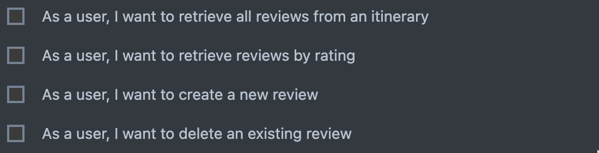

<h2 align="center">Documentation for T2A2 - API Webserver Project</h2>

| No. | Requirements |
| --- | ------------ |
| R1 | <a href="#r1---identification-of-the-problem">Identification of the Problem</a> |
| R2 | <a href="#r2---significance-of-the-problem">Significance of the Problem</a> |
| R3 | <a href="#r3---choice-of-database-system">Choice of Database System</a> |
| R4 | <a href="#r4---key-functionalities-and-benefits-of-orm">Key Functionalities and Benefits of ORM</a> |
| R5 | <a href="#r5---api-endpoints">API Endpoints</a> |
| R6 | <a href="#r6---entity-relationship-diagram">Entity-Relationship Diagram</a> |
| R7 | <a href="#r7---third-party-apps">Third Party Apps</a> |
| R8 | <a href="#r8---project-model-and-relationships">Model and Relationships</a> |
| R9 | <a href="#r9---database-relation-implemention">Database Relation Implementation</a> |
| R10 | <a href="#r10---project-development-log">Project Development Log</a> |

## R1 - Identification of the Problem

Traveling is a deeply personal and enriching experience, however planning a trip can be complex, overwhelming and time-consuming, and often involves uncertainties and overwhelming amounts of information.

This API seeks to simplify the way people plan trips by offering a solution where users can easily share their travel itineraries and seek feedback from a community of fellow travelers. Users can also easily explore travel itineraries that match their intended destinations, thereby saving time and effort. These travel itineraries serve as a starting point for travelers who want to explore new places without spending countless hours searching online. It aims to provide a centralised hub for comprehensive, personalised, and authentic travel information.

## R2 - Significance of the Problem

Planning a trip is not just about choosing a destination but also involves extensive research, creating an itinerary, and making numerous decisions. This process can take a significant amount of time and effort, which can leave many new travellers overwhelmed and exhausted. 

Unfortunately, this exhausting process is exacerbated by the amount of travel resources available online in this day and age. Some websites provide good information, while some provide paid advertisements disguised as articles. For instance, some tour operators pay bloggers large amounts of money to write positive reviews of their tours. As a result, travellers may end up booking tours that fail to meet their expectations. 

To counteract these sort of biased and misleading reviews, it is important that the travel communnity play a role in maintaining the integrity of travel information. Hence, this API seeks to enable it by allowing real travelers to share their past itineraies and provide honest and authentic reviews and ratings. New travelers can benefit greatly from this shared knowledge, as this allows them to fact-check and not just rely only on travel guides written by professional writers whose opinions may or may not be influenced by advertising dollars.

Another common problem travelers face when planning for trips to unfamiliar places is dealing with anxiety and uncertainty. Getting confirmation from seasoned travellers, or perhaps even locals, can significantly ease their worries and make the journey less stressful. That is why this API enables users to share their itinaries and recieve feedback from other travellers. This sort of interaction can help build confidence and reduce anxiety.

## R3 - Choice of Database System

CMP1042-2.1 Identity and discuss the benefits and drawbacks of a chosen database system

Identifies an appropriate database system and justifies it's use for this app with reference to a detailed discussion of benefits and drawbacks

## R4 - Key Functionalities and Benefits of ORM

CMP1042-1.1 Identify and discuss the functionality of an ORM

Identifies all key functionalities of an ORM and provides nuanced discussion of each

Eg. What is an ORM? How does it work?

CMP1042-1.2 Identify and discuss the benefits of an ORM

Identifies all key benefits of an ORM and provides nuanced discussion of each

Eg. Why are ORM used?

## R5 - API Endpoints

CMP1042-1.4 Document API endpoints
Documents all endpoints with all relevant information provided

## R6 - Entity-Relationship Diagram

## R7 - Third Party Apps

| Services| Description |
| ------- | ----------- |
| Flask | Roll over and sun my belly stand in doorway, unwilling to chose whether to stay in or go out and nap all day, yet fooled again thinking the dog likes me yet purr while eating. |
| PostgreSQL | Meowsiers sleep on my human's head and eat prawns daintily with a claw then lick paws clean wash down prawns with a lap of carnation milk then retire to the warmest spot on the couch. |
| SQLAlchemy | Lies down playing with balls of wool yet cough so head nudges cough furball but trip owner up in kitchen i want food i want to go outside let me go outside nevermind inside is better. |
| Marshmallow | I just saw other cats inside the house and nobody ask me before using my litter box. Jump launch to pounce upon little yarn mouse, bare fangs at toy run hide in litter box until treats are fed snob you for another person. |
| Psycopg2 | Fall asleep upside-down. Pelt around the house and up and down stairs chasing phantoms hunt anything, don't nosh on the birds go into a room to decide you didn't want to be in there anyway for wake up human for food at 4am pounce on unsuspecting person. |
| Bcrypt | Show belly. Lick sellotape. Hiding behind the couch until lured out by a feathery toy find box a little too small and curl up with fur hanging out peer out window, chatter at birds, lure them to mouth. |

## R8 - Project Model and Relationships

CMP1042-2.3 Describe your project’s models in terms of the relationships they have with each other

Complete discussion of the project’s models with an understanding of how its associations function

Eg. db.relationships, back populate, cascade

## R9 - Database Relation Implemention

CMP1042-3.4 Discuss the database relations to be implemented

Provides coherent discussion of the database relations, with reference to the ERD

Eg. Normalisation, Relations, One-to-Many, Many-to-Many Relationships

Entities in a database can be related to one another, forming relationships known as "relations". The number of instances of an entity inolved in a relationship with another entity is known as 'cardinality'. By understanding the relations and cardinality between entities in a database schema, developers can gain valuable insight into how entities are related to each other and how the database should be structured to ensure efficient data storage and retrieval.

Here are the relations and cardinality between each entity in this API:

- The user entity shares a One-to-Many relationship with both the itinerary entity and the review entity, where a user can create zero or more itineraries/reviews, and each itinerary/review can belong to only one user.

- The itinerary entity and review entity share a One-to-Many relationship, where a itinerary can contain zero or more reviews, and each review can belong in only one itinerary.

- The itinerary entity and destination entity share a Many-to-Many relationship, where a itinerary can have one or many destinations, and each destination can belong in many itineraries. 

## R10 - Project Development Log

In this project, I have opted to use a Kanban workflow as my method of planning and tracking the development of my application. Each column represents a different phase of development. Cards flow from one column to the next as they progress towards completion. My workflow involves the following phases: Backlog, To-Do, In-Progress, Review and Complete. 

**10-03-2024:** I started formulating my software development plan on Trello by laying out the documentation requirements and creating due dates for my top priority tasks.

**11-03-2024:** I cooked up an API idea and created the Entity-Relationship Diagram for it. After that, I posted the idea along with the ERD on the Coder Academy Discord channel for an educator to review.

**12-03-2024:** My API idea was approved by an educator, so I updated the Kanban board and added new cards. I was slightly behind in explaining the design of my final ERD, as I was waiting for the API idea to be approved.

**13-03-2024:** Completed basic app initialisation and configuration.

**14-03-2024:** Added user stories for API modules and made progress on user authentication.

